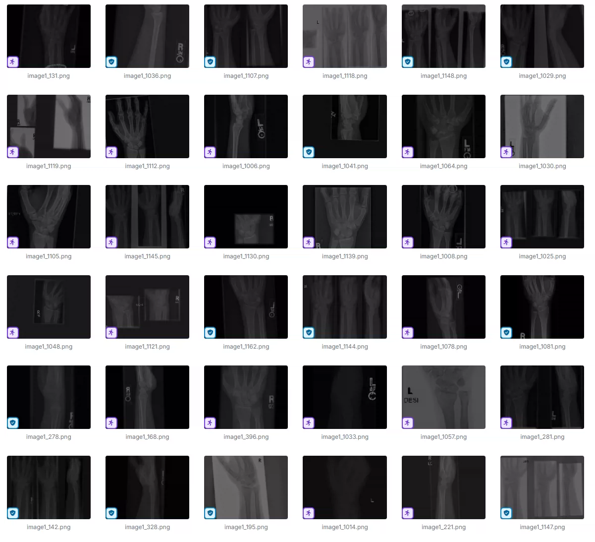
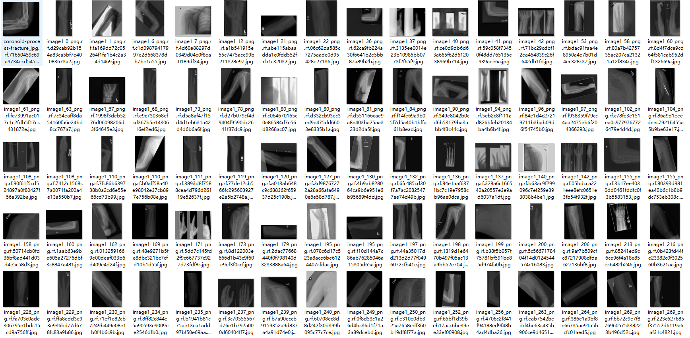
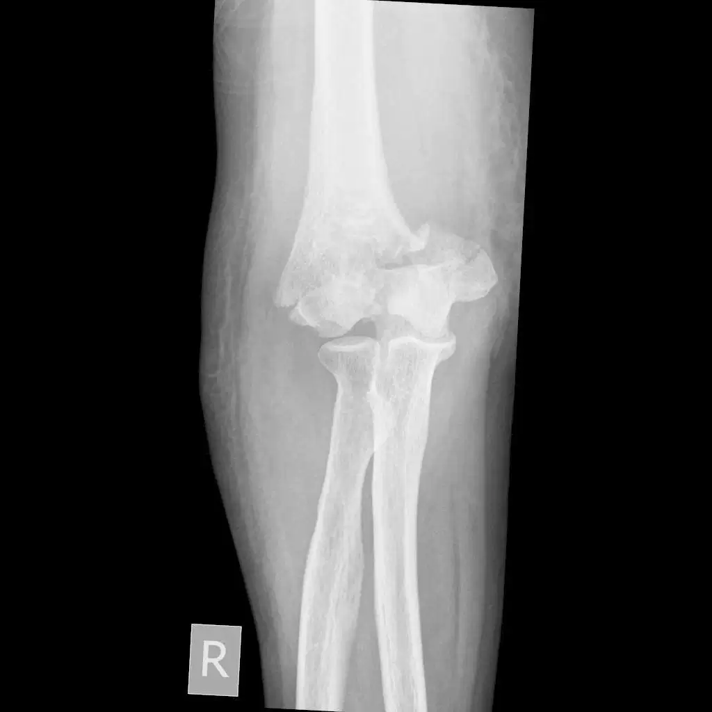
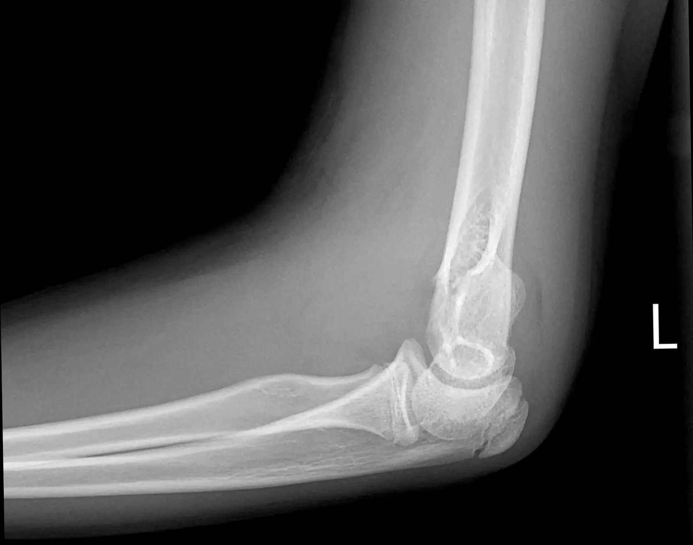
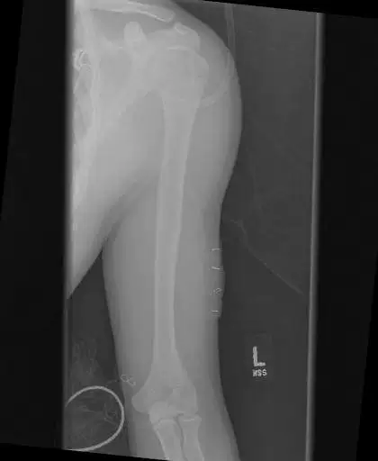
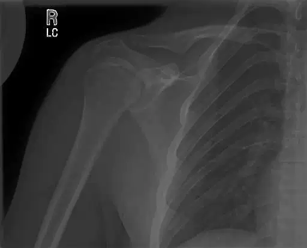

## Body

Hand, Elbow, Humerus Fracture Detection Dataset

Totally over 4000 images, each labeled with tags.
It is divided into 7 categories: 'Elbow Positive', 'Fingers Positive', 'Forearm Fracture', 'Humerus Fracture', 'Humerus', 'Shoulder Fracture', 'Wrist Positive'
"Elbow Positive", "Fingers Positive", "Forearm Fracture", "Humerus Fracture", "Humerus", "Shoulder Fracture", "Wrist Positive"

Electronic virtual products sold are not returnable.

## Images

Here is a pay link on Stripe ( https://buy.stripe.com/3cs8yP7sY87d0vu9AB ). Please contact me lonlonago@foxmail.com after funding $89, and I will send you a complete data files , thank you!

